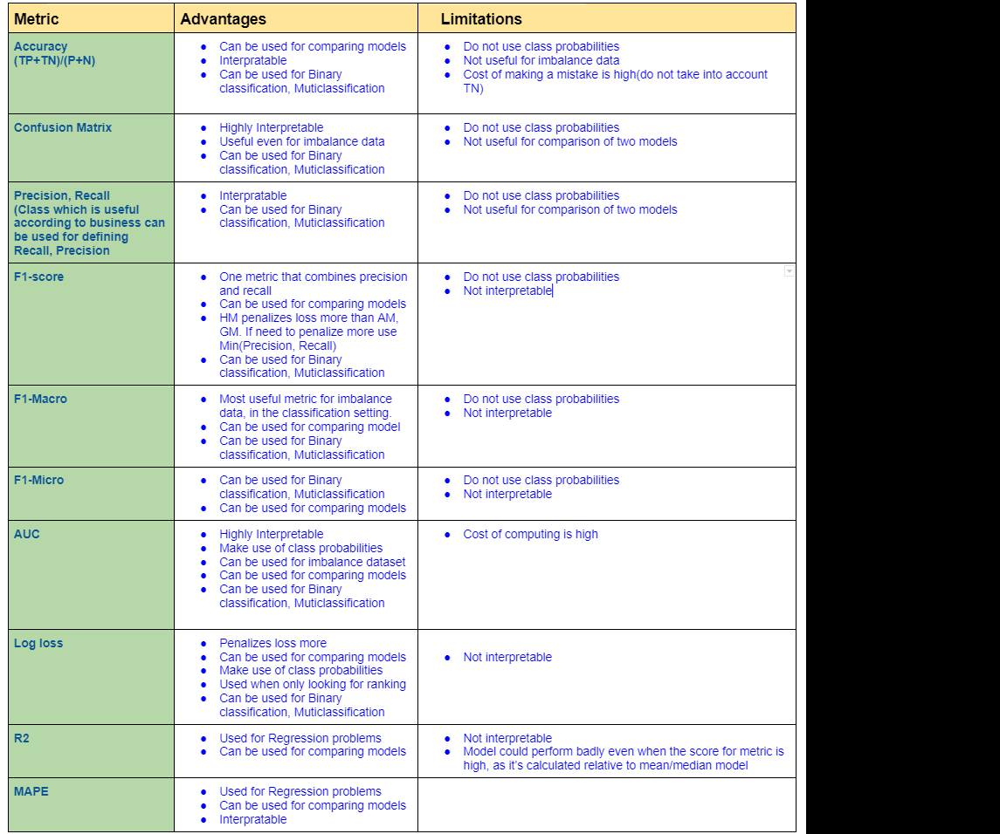

# Implement-Performance-metrics-without-Sklearn
## Most common Classification/Regression metrics:

####1.  Accuracy
####2.  Confusion Matrix
####3.  Precision
####4.  Recall
####5.  F1-Score
####6.  F1-Macro
####7.  F1-Micro
####8.  AUC
####9.  Log loss
####10. Mean Square Error
####11. Mean Absolute Percentage Error
####12. R2

